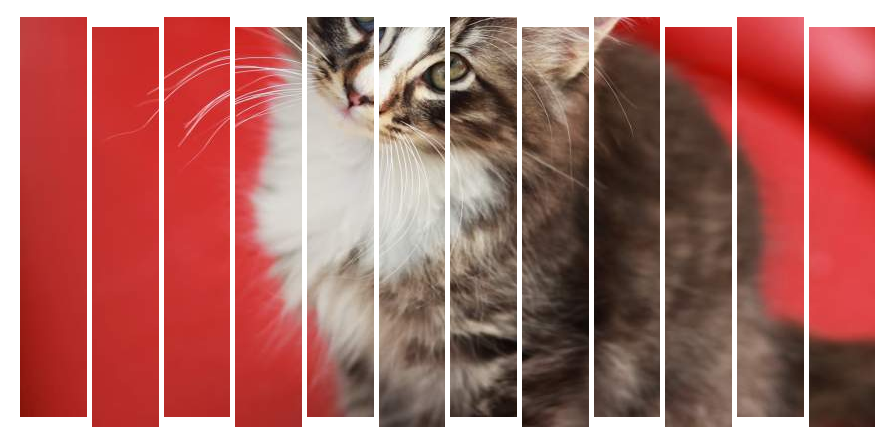

ChopChop!
========

ChopChop! is a jQuery plugin for slicing up images.

### Install

Just include the file and run it on an img element.

```javascript
$(document).ready(function(){
	$('.chopme').chopchop({
		slices: 10,
		gutters: 5,
		yDiff: 5
	});
});
```
or
```javascript
$(document).ready(function(){
	$('.chopme').chopchop();
});
```
Defaults are { slices: 5, gutters: 5, yDiff: 5 }

### Example
